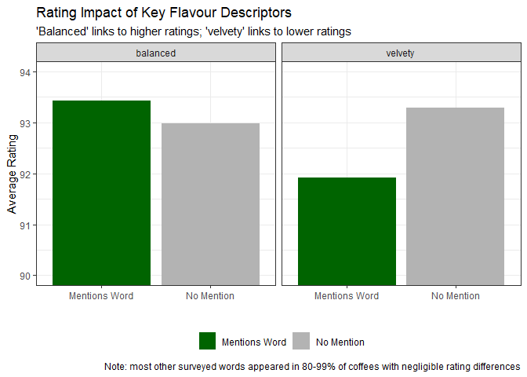
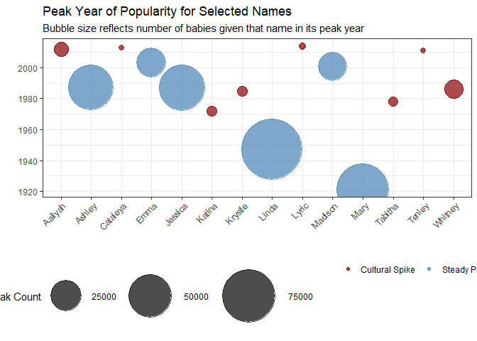
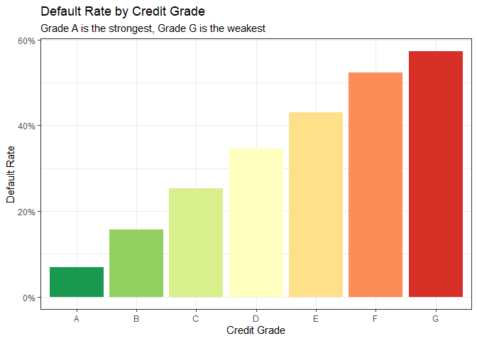
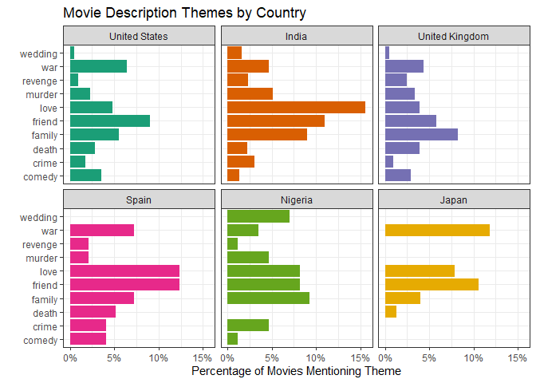

``` r
library(tidyverse)
options(dplyr.summarise.inform = F)
```

# Overview

This repository contains my solutions to the 4 practical exam questions.
Each question has its own folder, with an accompanying code folder
containing the functions used in that question’s analysis. Functions are
sourced automatically at the top of each R Markdown file using
list.files() and walk(). Data was excluded from GitHub using .gitignore.

This README summarises the approach taken in each question and
reproduces one key visual from each, sourced live from the relevant code
folder. The full analysis, including all figures, tables and written
findings, is contained in each question’s own output file.

# Question 1: Coffee Hub

**Output:** PowerPoint slides (Question_1.pptx)

The data had an apparent encoding issue. Some characters displayed
incorrectly in Excel. I checked this properly using
readr::guess_encoding(), and found UTF-8 was correct all along. The
“broken” characters were just an Excel display quirk, not a problem with
the actual file.

The origin_1 and origin_2 columns proved far messier than expected,
mixing continents, countries and specific growing districts. I went
through the unique values by hand and built a function to extract a
clean country from both columns, correcting a couple of misspellings
along the way. About 40% of coffees couldn’t be matched to a country
this way. I grouped these as “Other/Unclear” and excluded them from the
regional comparison, treating this as a limitation worth flagging rather
than hiding.

For the keyword analysis, I tested the flavour words from the student
wordcloud against coffee ratings. Most appeared in 80-99% of all
descriptions, too common to provide a useful signal. Two words stood out
as genuine exceptions: “balanced” linked to slightly higher ratings,
while “velvety” linked to lower ratings.

``` r
list.files('Question_1/code/', full.names = T, recursive = T) %>% 
    as.list() %>% walk(~source(.))

Coffee <- Load_Coffee("data/Coffee/Coffee.csv")
Coffee <- Coffee %>% Extract_Region()

Keyword_Highlight_Plot(Coffee)
```



# Question 2: Baby Names

**Output:** HTML report (Question_2.html)

I aggregated the state-level baby name data up to national totals by
name, year and gender before doing any analysis. For the persistence
analysis, I compared each year’s top 25 names to the top 25 three years
later using Spearman rank correlation, mapped across every year and both
genders. The result showed persistence was very stable through the early
20th century, with a much bigger dip in the late 1960s than anything
seen after 1990. The supervisor’s theory is only partially supported.
Naming has become somewhat less persistent in recent decades, but the
decline isn’t historically unprecedented.

For the spike investigation, the supervisor’s memory of a 1974 “Katina”
spike was close but not quite exact. The real spike was 1972. I scanned
all names for similarly large spikes and cross-referenced several
candidates against the Billboard and HBO datasets provided. Aaliyah and
Whitney both verified cleanly against Billboard, lining up with the
relevant singers’ chart careers. Lyric matched against an HBO movie
title released the year before its spike. A few other plausible
candidates couldn’t be verified, since the associated shows aren’t part
of the HBO catalogue supplied.

``` r
list.files('Question_2/code/', full.names = T, recursive = T) %>% 
    as.list() %>% walk(~source(.))

Baby_Names <- read_rds("data/US_Baby_names/Baby_Names_By_US_State.rds")
National_Names <- National_Baby_Names(Baby_Names)

NamesSelected <- c("Aaliyah", "Jessica", "Katina", "Lyric", "Mary",
                   "Tabitha", "Krystle", "Cataleya", "Tenley", "Whitney",
                   "Linda", "Emma", "Ashley", "Madison")

HighlightNames <- c("Aaliyah", "Katina", "Lyric", "Tabitha", "Krystle", 
                    "Cataleya", "Tenley", "Whitney")

Bubble_Plot_Names(National_Names, 
                  NamesSelected = NamesSelected,
                  HighlightNames = HighlightNames,
                  Sex = "F")
```



# Question 3: Loans and Credit

**Output:** Texevier PDF (Question_3.pdf)

I classified loan_status into a clean default/non-default variable,
treating Fully Paid as non-default and Charged Off, combined with the
small Default category, as default. Current, Late and Grace Period loans
were excluded, since their final outcome isn’t known yet.

I tested all three of the Director’s beliefs directly. The first, that
home owners and longer-employed borrowers default less, was well
supported. The second, that states differ in default culture, was also
well supported, with Texas itself sitting close to the middle of the
range rather than standing out as unusual.

The third was more mixed. Credit grade predicts default extremely well,
but the data has no age column at all, so the claim about younger
individuals couldn’t be tested. I also couldn’t confirm that interest
rates are clearly determined by occupation. I cleaned and grouped job
titles into broad categories using keyword matching, but even after that
effort, 47% of records stayed unclassified, and occupation showed only a
small relationship with interest rate compared to credit grade’s much
stronger effect.

For the DTI question, I found a steady, consistent rise in default rate
as DTI increases, with no single cliff edge, and presented a set of
tolerance levels rather than one fixed cap. I also found DTI’s
relationship with default differs by state. Alabama and Maine have
similar average DTI levels, but very different default rates.

I chose Texevier’s PDF output here, since the brief specifically called
for a formal write-up. Getting this working required a small LaTeX fix
for a Pandoc version mismatch, and some adjustment to figure sizes after
a few plots initially ran off the page.

``` r
list.files('Question_3/code/', full.names = T, recursive = T) %>% 
    as.list() %>% walk(~source(.))

Loan_Credit <- read_rds("data/Loan_Cred/loan_data.rds")
Loan_Credit <- Loan_Status(Loan_Credit)

Plot_Grade_Defaults(Loan_Credit)
```



# Question 4: Netflix

**Output:** HTML report (Question_4.html)

I worked with three datasets here: Titles and Credits, IMDb-sourced and
structured similarly to the HBO data from Question 2, and a separate
Netflix_movies CSV that turned out cleaner and more usable for the core
analysis. I selected six countries to focus on: United States, India,
United Kingdom, Spain, Nigeria and Japan.

For movie length, India’s films stood out clearly, averaging 127
minutes, well above every other country, fitting with the well-known
convention of longer Bollywood runtimes. For content maturity, I grouped
detailed ratings into three broader tiers, after excluding a handful of
US rows where a duration value had landed in the rating column by
mistake. Spain’s content turned out to be the most mature-skewed of the
six countries, while India’s was the least.

For the textual analysis, I searched for ten theme words across all six
countries’ movie descriptions. Relationship-driven themes like love,
friend and family consistently outranked darker themes like murder,
crime and revenge in every country, with India showing the strongest
skew toward love and friend specifically.

``` r
list.files('Question_4/code/', full.names = T, recursive = T) %>% 
    as.list() %>% walk(~source(.))

Movie_Info <- read_csv("data/netflix/netflix_movies.csv")
CountryList <- c("United States", "India", "United Kingdom", "Spain", "Nigeria", "Japan")
df_movies <- Prepare_Movie_Data(Movie_Info, CountryList = CountryList)

Theme_Words <- Movie_Theme_Words()
Theme_Results <- Theme_Words %>% map_df(~Theme_Extractor(df_movies, ThemeWord = .))

Plot_Theme_Comparison(Theme_Results, CountryList = CountryList)
```



For ratings, I joined IMDb and TMDB scores onto the country data. My
first attempt joined on title alone, which created duplicate rows since
52 titles in the Titles dataset aren’t unique. Joining on title and
release year together fixed this. As a bonus, I compared genre
popularity between Netflix and HBO, limiting the comparison to drama,
comedy and documentary, the genres with clearly comparable naming once
pluralization and terminology differences were resolved.
